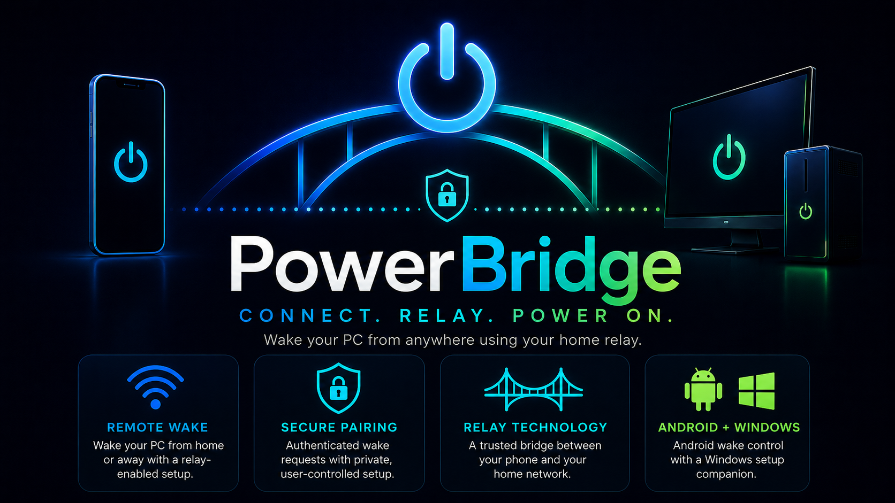

# PowerBridge



PowerBridge is a public Android Wake-on-LAN client with saved PC profiles, QR-assisted setup, diagnostics export, an AIO Android `Home Relay Mode` prototype, and an optional advanced path for user-owned relay infrastructure.

This repository packages the full public project:

* `android/` - the Android app
* `windows-companion/` - the Windows setup helper that generates scan-safe QR setup payloads

Latest public release:

```text
v0.6.1
```

Current development version:

```text
0.7.0
```

## What Works Now

PowerBridge currently supports:

* Saved PC profiles
* `Local Wi-Fi Wake`
* `Home Relay Server` for advanced user-owned relay setups
* AIO Android `Home Relay Mode` prototype inside the main PowerBridge app
* Guided wake setup and plain-language method selection
* Windows Companion QR setup import
* Local setup checks
* Diagnostics generation and user-initiated ZIP sharing

PowerBridge does not currently support:

* Shutdown
* Restart
* Hibernate
* Remote desktop control
* Target-side command execution
* Built-in cloud backend
* Built-in smart plug wake
* Built-in smart-home wake
* Built-in home-device relay wake

Architecture status note:

* `Home Relay Mode` exists only as a local prototype inside the main Android app
* `Phase 14B` added guided wake setup and plain-language method selection
* `Phase 14C` is the next local-only relay pairing/runtime phase
* see [docs/HOME-DEVICE-RELAY-ARCHITECTURE.md](docs/HOME-DEVICE-RELAY-ARCHITECTURE.md)
* see [docs/HOME-DEVICE-RELAY-CONTRACTS.md](docs/HOME-DEVICE-RELAY-CONTRACTS.md)
* see [docs/HOME-DEVICE-RELAY-PROTOTYPE-PLAN.md](docs/HOME-DEVICE-RELAY-PROTOTYPE-PLAN.md)
* see [docs/README.md](docs/README.md)

## Repository Layout

```text
PowerBridge/
  .github/workflows/
  android/
  windows-companion/
  assets/
  docs/
  BUILD.md
  INSTALL-NOTICE.txt
  LICENSE
  README.md
  SECURITY.md
  SIGNING.md
  THIRD-PARTY-NOTICES.md
  VERSION
```

## Product Boundary

PowerBridge is generic public software. It does not ship with developer-specific infrastructure, private relay defaults, private domains, private IP addresses, private MAC addresses, private tokens, or personal setup assumptions.

`Home Relay Server` means a relay owned and controlled by the user, such as a Raspberry Pi, NAS, Linux host, Docker host, router-based relay, or similar home-side system.

## Components

### Android App

The Android app is the AIO user-facing Android app. It stores PC profiles, sends local Wake-on-LAN packets, imports setup data from QR, generates diagnostics when the user requests them, and includes the prototype `Home Relay Mode` entry point for spare Android phone/tablet use.

See [android/README.md](android/README.md).

### Windows Companion

The Windows Companion is a setup helper only. It detects local network values for the selected adapter and generates a scan-safe QR code for Android import.

It does not wake the PC directly, install a service, modify BIOS or router settings, or collect secrets.

See [windows-companion/README.md](windows-companion/README.md).

## Honest Technical Limits

Wake-on-LAN depends on hardware, firmware, power state, driver behavior, OS configuration, and network topology.

Important limits:

* Ethernet is recommended for the most reliable Wake-on-LAN behavior.
* Wi-Fi wake may work on some laptops and devices, but it is hardware-dependent.
* Boot from full shutdown is often less reliable than wake from sleep.
* Remote or cellular wake requires a valid home-side anchor, relay, VPN/router path, or other user-owned mechanism.
* PowerBridge does not bypass NAT, firewalls, OS permissions, hardware limits, paid services, or vendor restrictions.

## Privacy Stance

PowerBridge does not include analytics by default. Diagnostics are generated locally and shared only when the user explicitly chooses to share them. Generated QR payloads and diagnostics may contain local network values and should not be posted publicly without redaction.

See:

* [docs/PRIVACY.md](docs/PRIVACY.md)
* [docs/PUBLIC-SANITIZATION.md](docs/PUBLIC-SANITIZATION.md)

## Build Overview

Android:

```powershell
Set-Location "<repo-root>\android"
.\gradlew.bat assembleDebug --no-daemon
.\gradlew.bat assembleRelease --no-daemon
```

Release-signing truth:

* `assembleDebug` produces a development APK
* `assembleRelease` may be unsigned in public CI when local signing properties are absent
* official public Android release assets should come from a locally signed release build
* GitHub Actions currently validates Android builds but does not hold private signing secrets in this phase

Windows Companion:

```powershell
Set-Location "<repo-root>\windows-companion"
pwsh -NoProfile -ExecutionPolicy Bypass -File ".\scripts\Test-PowerBridgeCompanion.ps1"
pwsh -NoProfile -ExecutionPolicy Bypass -File ".\src\PowerBridgeCompanion.ps1" -NoClipboard
```

More detail is in [BUILD.md](BUILD.md).

## Release Layout

When public releases begin, the GitHub release page should expose the deliverables as separate top-level assets, not as a bundled folder or nested archive.

Target release asset shape:

* `PowerBridge-vX.Y.Z.apk`
* `PowerBridge-Companion-Setup-vX.Y.Z.exe`

Release rule:

* keep the Android APK and Windows Companion installer as separate assets
* do not wrap them in an extra ZIP just to group them
* let users download the Android app or the Windows installer independently from the same release page

Current local release flow:

```powershell
Set-Location "<repo-root>"
pwsh -NoProfile -ExecutionPolicy Bypass -File ".\scripts\Build-PowerBridgeReleaseAssets.ps1"
pwsh -NoProfile -ExecutionPolicy Bypass -File ".\scripts\Publish-PowerBridgeRelease.ps1"
```

## Important Notice

PowerBridge is independent software provided without warranty. Use it at your own risk.

PowerBridge does not:

* guarantee wake success from every power state
* guarantee wake over every Wi-Fi, router, ISP, or cellular path
* bypass authentication or security controls
* modify router, BIOS, firewall, or operating-system settings automatically

## License

PowerBridge source and project-owned documentation in this repository are released under the MIT License. Third-party dependencies keep their own licenses.

See [LICENSE](LICENSE) and [THIRD-PARTY-NOTICES.md](THIRD-PARTY-NOTICES.md).
